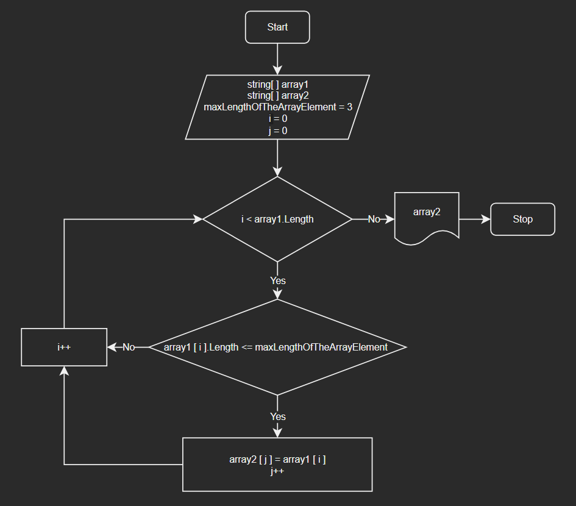

# Итоговая проверочная работа

## Задача

Написать программу, которая из имеющегося массива строк формирует новый массив из строк,
длина которых меньше, либо равна 3 символам. Первоначальный массив можно ввести с клавиатуры,
либо задать на старте выполнения алгоритма.

## Описание решения:

1. Создаем и заполняем строковый массив.
2. Определяем количество элементов в данном массиве, длина которых меньше или равна трём символам. Это количество будет определять размер нового массива для переноса элементов.
3. Создаем новый массив определённой ранее длины, заполняем его значениями по тому же условию.
4. Выводим результаты переноса элементов из первоначального строкового массива в новый строковый массив, согласно условию задачи.

## Блок-схема алгоритма решения задачи

